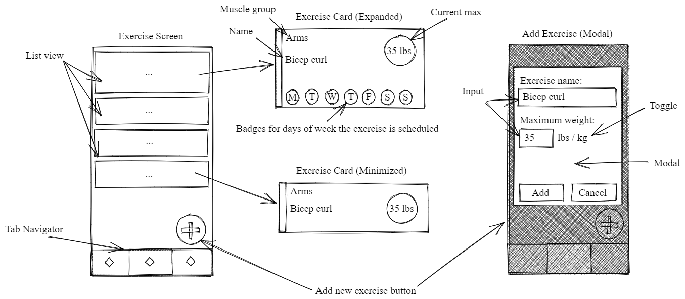
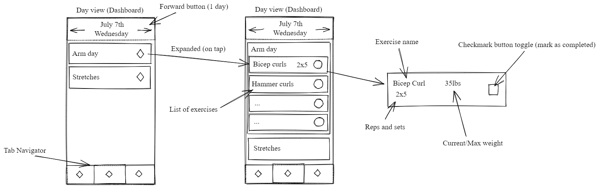

# GymAndy
### (The name doesn't make sense to me either)

I was looking on the iOS app store for a good free workout/exercise manager that doesn't have ads or push subscriptions in your face. So I'm making one for myself while I practice react-native and some random libraries I feel like using. Two birds, one stone.

### Planned functionality (at least for initial release)
Exercises:
- Add your own exercises (Won't be pulled from an API) 
- Categorize by muscle group/type
- Updateable with your current "milestone", ie. what your max weight was in your last workout, or run distance

Routines:
- Add previously created exercises and assign sets/reps
- Set repeatable/custom dates for each routine
- Mark routines as missed or completed, including failed reps

Day calendar view:
- Day calendar view where workout routines that are scheduled for current day will appear
- If none scheduled you can apply one without leaving current view

###### Diagrams made using [Excalidraw](https://www.excalidraw.com/)

